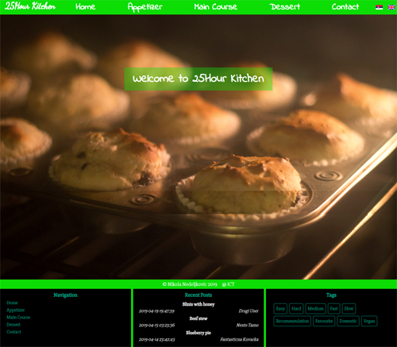
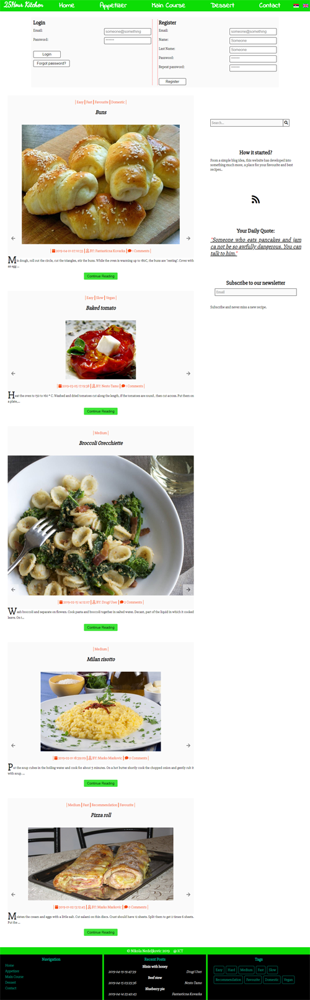
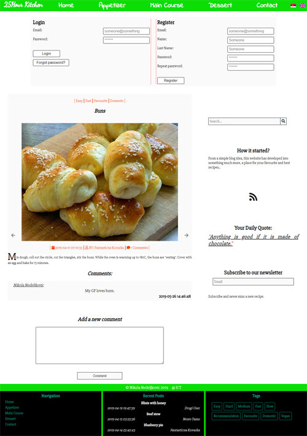
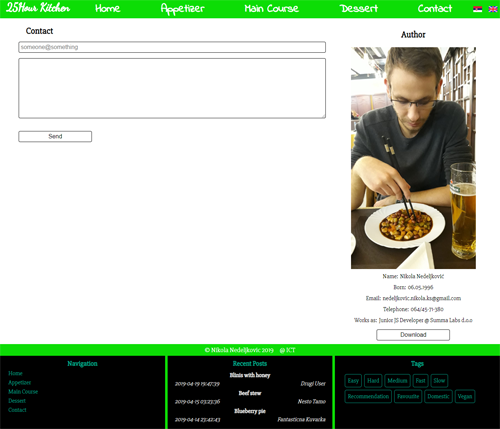

# 25h Kitchen

*Seventh, responsive, website created using PHP and JavaScript and jQuery made in my second year of studying.*

## Website Desing

### *Home page*

Landing page with a image gif and language change which reads from different JSON files.

### *Login and Register with Food page*

Login and register functionalities with dinamic showing of food.

### *Beard and Hair page*

Bootstrap design with my change using HTML and CSS.

### *Clothes page*

Bootstrap design with my change using HTML and CSS.