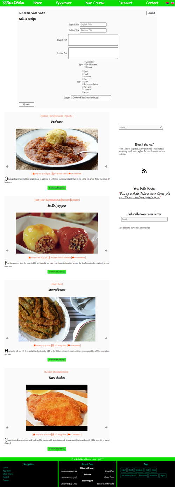

# 25h Kitchen

*Seventh, responsive, website created using PHP and JavaScript and jQuery made in my second year of studying.*

## Website Desing

### *Home page*

Landing page with a image gif and language change which reads from different JSON files.

### *Login and Register with Food page*

Login and register functionalities with dinamic showing of food.

### *Add recipe with Food page*

Add recipe functionality with dinamic showing of food.

### *Contact page*

Contact page with working mail sending with PHPMailer.

### *Admin page*

Working with all SQL data, seeing the states of user activity, downloading to Excel.